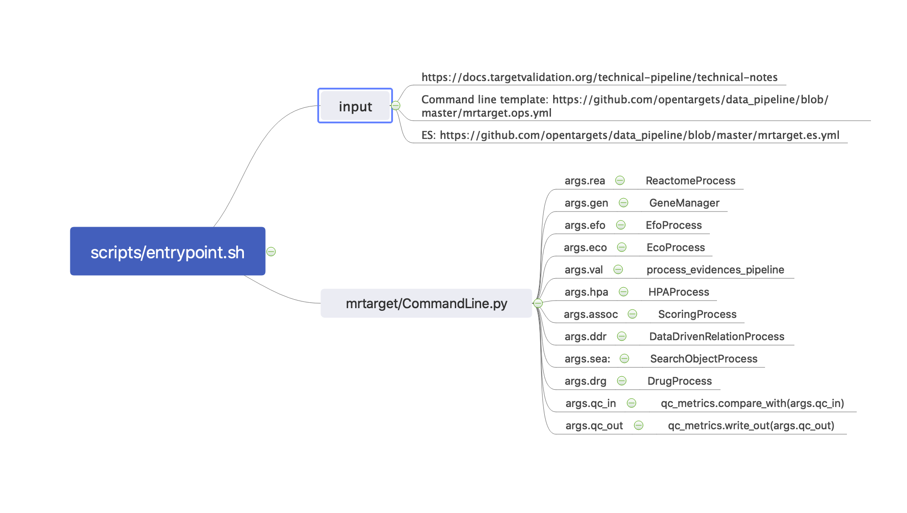
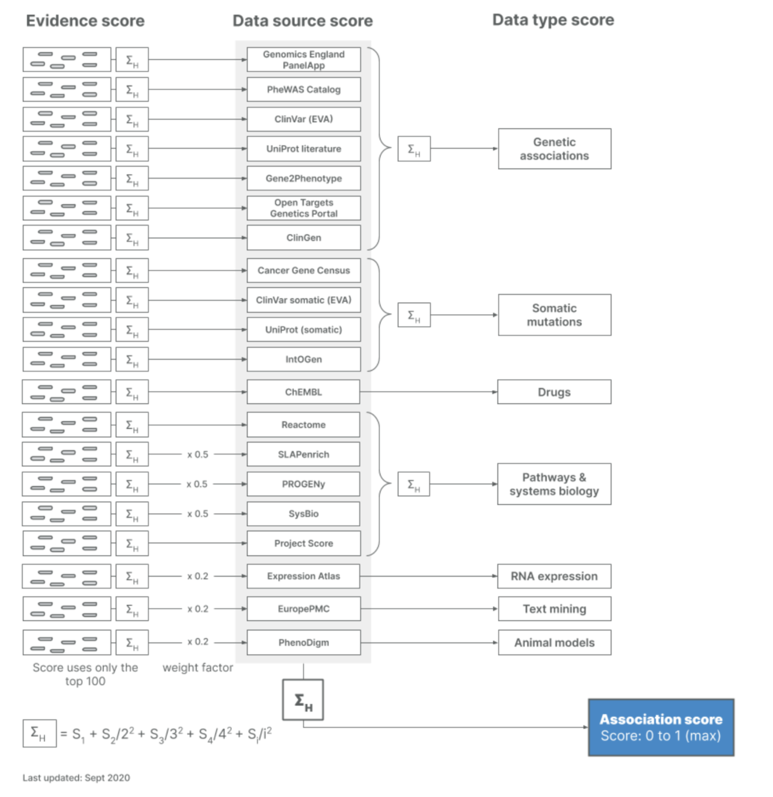

# ETL

## Repos

[**platform-input-support**](https://github.com/opentargets/platform-input-support) ****- scripts that process and prepare data for our ETL pipelines 

[**platform-etl-backend**](https://github.com/opentargets/platform-etl-backend) ****- ETL pipelines to generate associations, evidence, and entity indices 

\*\*\*\*[**platform-etl-openfda-faers** ](https://github.com/opentargets/platform-etl-openfda-faers) ****- ETL pipeline to process OpenFDA adverse events data 

[**json\_schema**](https://github.com/opentargets/json_schema) - evidence object schema used by ETL pipelines for evidence and association scoring

\*\*\*\*[**data\_pipeline**](https://github.com/opentargets/data_pipeline)  ****to process different data files that provide evidence for the target-disease associations in the Open Targets Platform. ****

\*\*\*\*

## ETL Workflow


Config.file : [https://github.com/opentargets/platform-input-support/blob/master/config.yaml](https://github.com/opentargets/platform-input-support/blob/master/config.yaml)

Yaml.file : [https://storage.googleapis.com/open-targets-data-releases/21.02/templates/template.mrtarget.data.21.02.yml](https://storage.googleapis.com/open-targets-data-releases/21.02/templates/template.mrtarget.data.21.02.yml) 

## Platform-input-support:

[**platform-input-support**](https://github.com/opentargets/platform-input-support) ****- scripts that process and prepare data for our ETL pipelines 

Collect data from various sources, put them into GCP.   

List of available steps:

* annotations
* annotations\_qc
* annotations\_from\_buckets
* ChEMBL
* chemical\_probes
* drug
* eco
* efo
* ensembl
* evidences
* interactions
* known\_target\_safety
* tep

Each step is an individual way to collect data. 

The input data is a config file, which contains the data source:   
[https://github.com/opentargets/platform-input-support/blob/master/config.yaml](https://github.com/opentargets/platform-input-support/blob/master/config.yaml) 

The output data are stored in three folders:

[http://ftp.ebi.ac.uk/pub/databases/opentargets/platform/21.02/input/annotation-files/](http://ftp.ebi.ac.uk/pub/databases/opentargets/platform/21.02/input/annotation-files/)

[http://ftp.ebi.ac.uk/pub/databases/opentargets/platform/21.02/input/evidence-files/](http://ftp.ebi.ac.uk/pub/databases/opentargets/platform/21.02/input/evidence-files/)

[http://ftp.ebi.ac.uk/pub/databases/opentargets/platform/21.02/input/evidence-files-subsets/](http://ftp.ebi.ac.uk/pub/databases/opentargets/platform/21.02/input/evidence-files-subsets/)

The  mrtage yam file contains all the locations of collected data, is part of the output 

[https://storage.googleapis.com/open-targets-data-releases/21.02/templates/template.mrtarget.data.21.02.yml](https://storage.googleapis.com/open-targets-data-releases/21.02/templates/template.mrtarget.data.21.02.yml)  


\*\*\*\*\*\*\*\*\*Note

this is only part of the data, the data from FAERS  treat separately. 


### \*\*\*\*


### EFO step \(disease\)

The scope of EFO is to support the annotation, analysis and visualization of data handled by the core ontology for Open Targets.

This step downloads and manipulates the input files and it generates the following output:

* ontology-efo-v3.xx.yy.jsonl : list of EFO terms
* ontology-mondo.jsonl : list of MONDO terms
* ontology-hpo.jsonl : list of HPO terms
* hpo-phenotypes-_yyyy-mm-dd_.jsonl : mapping between CrossReference databaseId

### Drug step

ChEMBL have made an Elasticsearch instance available for querying. To keep data volumes and running times down specify the index and fields which are required in the config file.

ChEMBL's ES instance is only available from within the EMBL-EBI VPN. If you need to run this step it is necessary that you use a machine that is connected to the VPN network.


## Data pipeline

[**data\_pipeline**](https://github.com/opentargets/data_pipeline)  ****to process different data files that provide evidence for the target-disease associations in the Open Targets Platform. ****




#### Overview

The pipeline can be broken down in a number of steps, each of which can be run as a separate command. Each command typically reads data from one or more sources \(such as a URL or local file, or Elasticsearch\) and writes into one or more Elasticsearch indexes.

**--rea Reactome**

Downloads and processes information into a local index for performance.

**--hpa Expression**

Downloads and processes information into a local index for performance.

**--gen Target**

Downloads and processes information from various sources. Is built around a "plugin" structure. Constructs an Elasticsarch index containg most of the information about each Target within the platform. It requires `--rea` reactome step. Note: HGNC,Ensembl,Uniprot plugins should always be first, as they initialize the gene list used in other plugins. Note: Chembl is required by the `--sea` step below.

**--efo Disease**

Downloads and processes the Experimental Factor Ontology, as well as Human Phenotype Ontology and other sources. Constructs an Elasticsarch index containg the information about each Disease within the platform.

**--eco Evidence Code**

Downloads and processes the Evidence Code Ontology and Sequence Ontology.

**--val Validation**

Read in evidence strings \(either from filesystem or URLs\) and validate. The validation includes syntatic JSON schema validation, as well as ensuring that the disease and target are appropriate. This step will also make some corrections to evidence, where appropriate. For example,replacing Uniprot protein identifiers with Ensembl gene identifiers. It requires `--gen` target, `--efo` disease, and `--eco` evidence code steps. It is expecting JSON matching schema [1.6.0](https://raw.githubusercontent.com/opentargets/json_schema/1.6.0/opentargets.json).

**--as Associations**

This step reads the valide evidence strings and calculates the appropriate assocations as well as calculated their scores. It requires `--val` validation, and `--hpa` expression steps.

**--sea Search**

This step will create the index `${DATA_RELEASE_VERSION}_search-data` which is used for the search function in the platform. It requires `--as` associations step.

**--ddr Relationships**

This step will compute the target-to-target and disease-to-disease relationships. It requires `--as` associations step.  





Inputs:



Command line template: https://github.com/opentargets/data\_pipeline/blob/master/mrtarget.ops.yml

ES: https://github.com/opentargets/data\_pipeline/blob/master/mrtarget.es.yml

### **--rea Reactome** 

**part of annotations data**

ReactomeProcess\(args.elasticseach\_nodes, es\_config.rea.name, es\_config.rea.mapping, es\_config.rea.setting, data\_config.reactome\_pathway\_data, data\_config.reactome\_pathway\_relation, args.rea\_workers\_writer, args.rea\_queue\_write\)

process\_all\(\)

-&gt; Reactome.py 

1. Generate a direct graph

Node from : reactome-pathway-data: [https://storage.googleapis.com/open-targets-data-releases/21.02/input/annotation-files/ReactomePathways-2021-02-09.txt](https://storage.googleapis.com/open-targets-data-releases/21.02/input/annotation-files/ReactomePathways-2021-02-09.txt)   
Edge from: reactome-pathway-relation: [https://storage.googleapis.com/open-targets-data-releases/21.02/input/annotation-files/ReactomePathwaysRelation-2021-02-09.txt](https://storage.googleapis.com/open-targets-data-releases/21.02/input/annotation-files/ReactomePathwaysRelation-2021-02-09.txt)

Node:{ id, name, species }

Edge:{id, child\_id}

2.  Save Graph to elastic search   
mapping: rea\_mappings.json

setting: rea\_settings.json 

docs = generate\_documents\(self.g\)

actions = elasticsearch\_actions\(docs, self.es\_index\)

set of dicts :dict\(id=node, label=node\_data\['name'\], path=paths, children=children, parents=parents, is\_root=node == 'root', ancestors=list\(ancestors\) \)


### **--hpa Expression**

\*\*\*\*

HPAProcess\(args.elasticseach\_nodes, es\_config.hpa.name, es\_config.hpa.mapping, es\_config.hpa.setting, data\_config.tissue\_translation\_map, data\_config.tissue\_curation\_map, data\_config.hpa\_normal\_tissue, data\_config.hpa\_rna\_level, data\_config.hpa\_rna\_value, data\_config.hpa\_rna\_zscore, args.hpa\_workers\_writer, args.hpa\_queue\_write\)

**inputs:**

args.elasticseach\_nodes,   
 es\_config.  
 hpa.name,   
 es\_config.hpa.mapping,   
 es\_config.hpa.setting,   
 data\_config.tissue\_translation\_map: none  
 data\_config.tissue\_curation\_map: none  
 hpa-normal-tissue: [https://storage.googleapis.com/open-targets-data-releases/21.02/input/annotation-files/normal\_tissue-2021-02-09.tsv](https://storage.googleapis.com/open-targets-data-releases/21.02/input/annotation-files/normal_tissue-2021-02-09.tsv)  
 hpa-rna-level: [https://storage.googleapis.com/open-targets-data-releases/21.02/input/annotation-files/baseline\_expression\_binned-2020-05-07.tsv](https://storage.googleapis.com/open-targets-data-releases/21.02/input/annotation-files/baseline_expression_binned-2020-05-07.tsv)  
 hpa-rna-value: [https://storage.googleapis.com/open-targets-data-releases/21.02/input/annotation-files/baseline\_expression\_counts-2020-05-07.tsv](https://storage.googleapis.com/open-targets-data-releases/21.02/input/annotation-files/baseline_expression_counts-2020-05-07.tsv)  
 hpa-rna-zscore: [https://storage.googleapis.com/open-targets-data-releases/21.02/input/annotation-files/baseline\_expression\_zscore\_binned-2020-05-07.tsv](https://storage.googleapis.com/open-targets-data-releases/21.02/input/annotation-files/baseline_expression_zscore_binned-2020-05-07.tsv)  
 args.hpa\_workers\_writer,   
 args.hpa\_queue\_write  


process\_all

```text
 self.hpa_normal_table = self.downloader.retrieve_normal_tissue_data()
        self.hpa_rna_table = self.downloader.retrieve_rna_data()
        self.hpa_merged_table = self.process_join()
        self.store_data(dry_run)
```

  
retrieve\_normal\_tissue\_data-&gt; download data from hpa-normal-tissue as CSV file, use it as a dictionary object.

retrieve\_rna\_data:  read data from hpa-rna-level and hpa-rna-zscore, then  melting rna level table into geneid tissue level.

process\_join\(\)-&gt;  melting retrieve\_normal\_tissue\_data and retrieve\_rna\_data, plus new format of expression \(dictionary\)

store\_data-&gt; save hpa\_merged\_table to elasticsearch

### **--gen Target**

```text
 process = GeneManager(args.elasticseach_nodes, es_config.gen.name, 
            es_config.gen.mapping, es_config.gen.setting, 
            args.gen_plugin_places, data_config.gene_data_plugin_names,
            data_config, es_config,
            args.gen_workers_writer, args.gen_queue_write )
        if not args.qc_only:
            process.merge_all(args.dry_run)
        if not args.skip_qc:
            qc_metrics.update(process.qc(es, es_config.gen.name))  
```

**inputs:**

args.elasticseach\_nodes  
 es\_config.gen.name  
 es\_config.gen.mapping  
 es\_config.gen.setting  
 args.gen\_plugin\_places  
 data\_config.gene\_data\_plugin\_names**:  null???**  
 data\_config  
 es\_config  
 args.gen\_workers\_writer  
 args.gen\_queue\_write


plugin system : [http://yapsy.sourceforge.net/\#](http://yapsy.sourceforge.net/#)

```text
plugin.plugin_object.merge_data(self.genes, 
                es, None, 
                self.data_config, self.es_config)
```

It seems like the genes obj is modified within a plugin.

```text
 gene._create_suggestions()
```

reorder gene's field, add suggestion filed, code below shows the content of suggestions. 

```text
    field_order = [self.approved_symbol,
                       self.approved_name,
                       self.symbol_synonyms,
                       self.name_synonyms,
                       self.previous_symbols,
                       self.previous_names,
                       self.uniprot_id,
                       self.uniprot_accessions,
                       self.ensembl_gene_id,
                       self.entrez_gene_id,
                       self.refseq_ids
                       ]
   self._private['suggestions'] = dict(input = [],
                                              output = self.approved_symbol,
                                              payload = dict(gene_id = self.id,
                                                             gene_symbol = self.approved_symbol,
                                                             gene_name = self.approved_name),
                                              )


        for field in field_order:
            if isinstance(field, list):
                self._private['suggestions']['input'].extend(field)
            else:
                self._private['suggestions']['input'].append(field)
        try:
            self._private['suggestions']['input'] = [x.lower() for x in self._private['suggestions']['input']]
        except:
            print("error", repr(self._private['suggestions']['input']))
```

```text
gene._create_facets()
```

add pathway info in gene.\_create\_facets\(\) step.  code below shows how it does. 

```text
 self._private['facets']['reactome']=dict(pathway_code = pathways,
              # pathway_name=pathways,
               pathway_type_code=pathway_types,
              # pathway_type_name=pathway_types,
  )
```

  
Then gene is stored in elastic search. 

### **--efo Disease**

```text
  process = EfoProcess(args.elasticseach_nodes, es_config.efo.name, 
            es_config.efo.mapping, es_config.efo.setting, 
            data_config.ontology_efo, data_config.ontology_hpo, 
            data_config.ontology_mp, data_config.disease_phenotype,
            args.efo_workers_writer, args.efo_queue_write)
        if not args.qc_only:
            process.process_all(args.dry_run)
```

**inputs:**

args.elasticseach\_nodes  
 es\_config.efo.name  
 es\_config.efo.mapping  
 es\_config.efo.setting  
ontology-efo: [https://storage.googleapis.com/open-targets-data-releases/21.02/input/annotation-files/ontology/efo\_otar\_slim.owl](https://storage.googleapis.com/open-targets-data-releases/21.02/input/annotation-files/ontology/efo_otar_slim.owl)  
 ontology-hpo: [https://storage.googleapis.com/open-targets-data-releases/21.02/input/annotation-files/ontology/hp.owl](https://storage.googleapis.com/open-targets-data-releases/21.02/input/annotation-files/ontology/hp.owl)  
 ontology-mp: [https://storage.googleapis.com/open-targets-data-releases/21.02/input/annotation-files/ontology/ontology-mp-2021-02-08.owl](https://storage.googleapis.com/open-targets-data-releases/21.02/input/annotation-files/ontology/ontology-mp-2021-02-08.owl)  
 disease-phenotype:- [https://storage.googleapis.com/open-targets-data-releases/21.02/input/annotation-files/ontology/ibd\_2\_pheno\_associations-2021-02-08.owl](https://storage.googleapis.com/open-targets-data-releases/21.02/input/annotation-files/ontology/ibd_2_pheno_associations-2021-02-08.owl)  
 args.efo\_workers\_writer  
 args.efo\_queue\_write

**process\_all**

```text
def process_all(self, dry_run):
        self._process_ontology_data()
        self._store_efo(dry_run)

```

rprocess\_ontology\_data:

refers to : [https://github.com/opentargets/ontology-utils](https://github.com/opentargets/ontology-utils)

create a text block definition/description by joining others together

build a set of all the relevant synonyms

\*need to dig into ontology utils and EFO.py

**\_store\_efo**

store data into elasticsearch


### **--eco Evidence Code** 

in this step, it does not score the evidence, did it in the validation step. 

```text
process = EcoProcess(args.elasticseach_nodes, es_config.eco.name, 
            es_config.eco.mapping, es_config.eco.setting,
            data_config.ontology_eco, data_config.ontology_so,
            args.eco_workers_writer, args.eco_queue_write)
        if not args.qc_only:
            process.process_all(args.dry_run)
```

**inputs:**

args.elasticseach\_nodes  
 es\_config.eco.name  
 es\_config.eco.mapping  
 es\_config.eco.setting  
 data\_config.ontology-eco: [https://storage.googleapis.com/open-targets-data-releases/21.02/input/annotation-files/ontology/ontology-eco-2021-02-09.owl](https://storage.googleapis.com/open-targets-data-releases/21.02/input/annotation-files/ontology/ontology-eco-2021-02-09.owl)  
 data\_config.ontology-so: [https://storage.googleapis.com/open-targets-data-releases/21.02/input/annotation-files/ontology/ontology-so-2021-02-09.owl](https://storage.googleapis.com/open-targets-data-releases/21.02/input/annotation-files/ontology/ontology-so-2021-02-09.owl)  
 args.eco\_workers\_writer  
 args.eco\_queue\_write

**process\_all**

```text
def process_all(self, dry_run):
        self._process_ontology_data()
        self._store_eco(dry_run)
```

  
**process\_ontology\_data:**

Loads evidence from ECO, SO and the Open Targets evidence classes

Namespace**??** classes\_paths??

The codes below are from [https://github.com/opentargets/ontology-utils](https://github.com/opentargets/ontology-utils)  
eco\_so.py

```text
cttv = rdflib.Namespace(str("http://www.targetvalidation.org/disease"))
    ot = rdflib.Namespace(str("http://identifiers.org/eco"))

    #namespace_manager = NamespaceManager(self.rdf_graph)
    ocr.rdf_graph.namespace_manager.bind('cttv', cttv)
    ocr.rdf_graph.namespace_manager.bind('ot',ot)

    open_targets_terms = {
        'http://www.targetvalidation.org/disease/cttv_evidence':'CTTV evidence',
        'http://identifiers.org/eco/drug_disease':'drug-disease evidence',
        'http://identifiers.org/eco/target_drug':'biological target to drug evidence',
        'http://identifiers.org/eco/clinvar_gene_assignments':'ClinVAR SNP-gene pipeline',
        'http://identifiers.org/eco/cttv_mapping_pipeline':'CTTV-custom annotation pipeline',
        'http://identifiers.org/eco/GWAS':'Genome-wide association study evidence',
        'http://identifiers.org/eco/GWAS_fine_mapping': 'Fine-mapping study evidence',
        'http://identifiers.org/eco/somatic_mutation_evidence':'Somatic mutation evidence',
        'http://www.targetvalidation.org/evidence/genomics_evidence':'genomics evidence',
        'http://targetvalidation.org/sequence/nearest_gene_five_prime_end':'Nearest gene counting from 5&apos; end',
        'http://targetvalidation.org/sequence/regulatory_nearest_gene_five_prime_end':'Nearest regulatory gene from 5&apos; end',
        'http://www.targetvalidation.org/evidence/literature_mining':'Literature mining',
        'http://www.targetvalidation.org/provenance/DatabaseProvenance':'database provenance',
        'http://www.targetvalidation.org/provenance/ExpertProvenance':'expert provenance',
        'http://www.targetvalidation.org/provenance/GWAS_SNP_to_trait_association':'GWAS SNP to trait association',
        'http://www.targetvalidation.org/provenance/LiteratureProvenance':'literature provenance',
        'http://www.targetvalidation.org/provenance/disease_to_phenotype_association':'disease to phenotype association',
        'http://www.targetvalidation.org/provenance/gene_to_disease_association':'gene to disease association',
        'http://identifiers.org/eco/locus_to_gene_pipeline':'Open Targets Genetics portal locus to gene annotation pipeline',
        'http://identifiers.org/eco/PheWAS': 'PheWAS catalog evidence'
    }

    for uri, label in open_targets_terms.items():
        u = rdflib.URIRef(uri)
        ocr.rdf_graph.add((u, rdflib.RDF.type, rdflib.term.URIRef(u'http://www.w3.org/2002/07/owl#Class')))
        ocr.rdf_graph.add([u, rdflib.RDFS.label, rdflib.Literal(label)])
        ocr.rdf_graph.add([u, rdflib.RDFS.subClassOf, evidence_uri])

```

add info into  evidence\_ontology.rdf\_graph  and evidence\_ontology.classes\_paths 

generate eco object, store into database.

```text
 eco = ECO(uri,
                      label,
                      self.evidence_ontology.classes_paths[uri]['all'],
                      self.evidence_ontology.classes_paths[uri]['ids'],
                      self.evidence_ontology.classes_paths[uri]['labels']
                      )

```


### **--val Validation** 

fix\_and\_score\_evidence????

```text
process_evidences_pipeline(data_config.input_file, args.val_first_n,
            args.elasticseach_nodes, es_config.val_right.name, es_config.val_wrong.name, 
            es_config.val_right.mapping, es_config.val_wrong.mapping, 
            es_config.val_right.setting, es_config.val_wrong.setting, 
            es_config.gen.name, es_config.eco.name, es_config.efo.name,
            args.dry_run,
            args.val_append_data,
            args.val_workers_validator, args.val_queue_validator,
            args.val_workers_writer, args.val_queue_validator_writer,
            args.val_cache_target, args.val_cache_target_u2e, args.val_cache_target_contains,
            args.val_cache_eco, args.val_cache_efo, args.val_cache_efo_contains,
            data_config.eco_scores, data_config.schema,
            data_config.excluded_biotypes, data_config.datasources_to_datatypes)
```

**inputs:**

data\_config.input\_file  
 args.val\_first\_n  
 args.elasticseach\_nodes  
 es\_config.val\_right.name  
 es\_config.val\_wrong.name  
 es\_config.val\_right.mapping  
 es\_config.val\_wrong.mapping  
 es\_config.val\_right.setting  
 es\_config.val\_wrong.setting  
 es\_config.gen.name  
 es\_config.eco.name  
 es\_config.efo.name  
 args.dry\_run  
 args.val\_append\_data  
 args.val\_workers\_validator  
 args.val\_queue\_validator  
 args.val\_workers\_writer  
 args.val\_queue\_validator\_writer  
 args.val\_cache\_target  
 args.val\_cache\_target\_u2e  
 args.val\_cache\_target\_contains  
 args.val\_cache\_eco  
 args.val\_cache\_efo  
 args.val\_cache\_efo\_contains  
eco-scores: [https://storage.googleapis.com/open-targets-data-releases/21.02/input/annotation-files/eco\_scores-2021-02-09.tsv](https://storage.googleapis.com/open-targets-data-releases/21.02/input/annotation-files/eco_scores-2021-02-09.tsv)  
 data\_config.schema: [https://raw.githubusercontent.com/opentargets/json\_schema/1.7.5/opentargets.json](https://raw.githubusercontent.com/opentargets/json_schema/1.7.5/opentargets.json)  
 data\_config.excluded\_biotypes  
 data\_config.datasources\_to\_datatypes  


###  **--as Associations**

**The main part of associations is association scores.** 

**the detail about the** scoring **algorithm  can be found at**  [**https://docs.targetvalidation.org/getting-started/scoring**](https://docs.targetvalidation.org/getting-started/scoring) ****

**Summary of the algorithm:**

Their  scoring framework is a four-tier process:

1. score the **individual evidence  \(validation step\)**
2. aggregate the evidence scores into **data sources** scores
3. aggregation of data source scores to give rise to the **data types** scores
4. overall association score is the result of the aggregation of all data source scores together




**Codebase**

```text
if args.assoc:
        process = ScoringProcess(args.elasticseach_nodes, es_config.asc.name, 
                es_config.asc.mapping, es_config.asc.setting,
                es_config.gen.name, es_config.val_right.name, es_config.hpa.name, es_config.efo.name,
                args.as_workers_writer, args.as_workers_production, args.as_workers_score, 
                args.as_queue_score, args.as_queue_production, args.as_queue_write,
                args.as_cache_hpa, args.as_cache_efo, args.as_cache_target, 
                data_config.scoring_weights, data_config.is_direct_do_not_propagate,
                data_config.datasources_to_datatypes)
        if not args.qc_only:
            process.process_all(args.dry_run)
```

**inputs:**

args.elasticseach\_nodes  
 es\_config.asc.name  
 es\_config.asc.mapping  
 es\_config.asc.setting  
 es\_config.gen.name  
 es\_config.val\_right.name  
 es\_config.hpa.name  
 es\_config.efo.name  
 args.as\_workers\_writer  
 args.as\_workers\_production  
 args.as\_workers\_score  
 args.as\_queue\_score  
 args.as\_queue\_production  
 args.as\_queue\_write  
 args.as\_cache\_hpa  
 args.as\_cache\_efo  
 args.as\_cache\_target  
 data\_config.scoring\_weights  
 data\_config.is\_direct\_do\_not\_propagate  
 data\_config.datasources\_to\_datatypes

**scoring\_weights**

```text
scoring_weights:
  crisp: 1
  europepmc: 0.2
  expression_atlas: 0.2
  phenodigm: 0.2
  progeny: 0.5
  slapenrich: 0.5
  sysbio: 0.5
```

**is\_direct\_do\_not\_propagate:**

```text
is_direct_do_not_propagate:
- expression_atlas
```

  
**datasources\_to\_datatypes:** 

```text
datasources_to_datatypes:
  cancer_gene_census: somatic_mutation
  chembl: known_drug
  clingen: genetic_association
  crispr: affected_pathway
  europepmc: literature
  eva: genetic_association
  eva_somatic: somatic_mutation
  expression_atlas: rna_expression
  gene2phenotype: genetic_association
  genomics_england: genetic_association
  gwas_catalog: genetic_association
  intogen: somatic_mutation
  ot_genetics_portal: genetic_association
  phenodigm: animal_model
  phewas_catalog: genetic_association
  postgap: genetic_association
  progeny: affected_pathway
  reactome: affected_pathway
  slapenrich: affected_pathway
  sysbio: affected_pathway
  uniprot_literature: genetic_association
  uniprot_somatic: somatic_mutation
```


**process\_all:**

pipeline stage for making the lists of the target/disease pairs and evidence

```text
pipeline_stage1 = pr.flat_map(produce_evidence, targets, 
            workers=self.workers_production,
            maxsize=self.queue_produce,
            on_start=produce_evidence_local_init_baked)
```

**inputs**:

**produce\_evidence**, is a function, which returns  \(evidence\['target'\]\['id'\], efo,evidence, is\_direct\), also it calculate the  **association\_score for each evidence.** 

```text
def produce_evidence(target, es, es_index_val_right,
        scoring_weights, is_direct_do_not_propagate, datasources_to_datatypes):
```

**get\_evidence\_for\_target\_simple**:  get evidence from elasticsearch.  

This update the score of given evidence??? based on the data_source scoring\_weights?_

```text
            for evidence in get_evidence_for_target_simple(es, target, es_index_val_right):
             #  get_evidence_for_target_simple  
             #fields = ['target.id', 'private.efo_codes', 'disease.id','scores.association_score','sourceID','id']
  
            ....
            key = (evidence['target']['id'], efo)
            ....
            score = evidence['scores']['association_score']
            if data_source in scoring_weights:
                score = score * scoring_weights[data_source]
                ....
            row = EvidenceScore(score, data_type, data_source, is_direct)
            data_cache[key].append(row)
                   #    class EvidenceScore(object):
                   #    def __init__(self, score, datatype, datasource, is_direct):
                   #     self.score = score
                   #     self.datatype = datatype
                   #     self.datasource = datasource
                   #     self.is_direct = is_direct
           ....
           return_values.append((key[0],key[1], evidence, is_direct))
```

**targets**: from elasticsearch.

**produce\_evidence\_local\_init\_baked:**

pipeline stage for scoring the evidence sets includes writing to elasticsearch

```text
 pipeline_stage2 = pr.map(score_producer, pipeline_stage1, 
            workers=self.workers_score,
            maxsize=self.queue_score,
            on_start=score_producer_local_init_baked)
```

score\_producer is a function

```text

def score_producer(data, 
        scorer, lookup_data, datasources_to_datatypes, dry_run):
```

**inputs**:

data = target, disease, evidence, is\_direct 

it iterates the evidence, counts the evidence, harmonic\_sum  the score

```text
from: score = scorer.score(target, disease, evidence, is_direct, 
            datasources_to_datatypes)
            
to: 
def score(self,target, disease, evidence_scores, is_direct, datasources_to_datatypes):

....
# init evidence_count['datasources'] and evidence_count['datatypes']
 association = Association(target, disease, is_direct, datasources, datatypes)
 
 
  # set evidence counts
        for e in evidence_scores:
            # make sure datatype is constrained
            if all([e.datatype in association.evidence_count['datatypes'],
                    e.datasource in association.evidence_count['datasources']]):
                association.evidence_count['total']+=1
                association.evidence_count['datatypes'][e.datatype]+=1
                association.evidence_count['datasources'][e.datasource]+=1

                # set facet data
                association.set_available_datatype(e.datatype)
                association.set_available_datasource(e.datasource)

## compute harmonic sum with quadratic (scale_factor) degradation
        #limit to first 100 entries and scale with afactor of 2
        self._harmonic_sum(evidence_scores, association, 100, 2, datasources_to_datatypes)

```

**harmonic\_sum :**

HarmonicSumScorer**:** 

**1.**calculate _datasource_ scorers

2.calculate datatypes\_score

3 calculate overall score

the score is store in association property of "**dict**\[method\]"

```text
 def _harmonic_sum(self, evidence_scores, association, 
            max_entries, scale_factor, datasources_to_datatypes):
        har_sum_score = association.get_scoring_method(ScoringMethods.HARMONIC_SUM)
        datasource_scorers = {}
        for e in evidence_scores:
            if e.datasource not in datasource_scorers:
                datasource_scorers[e.datasource]= HarmonicSumScorer(buffer=max_entries)
            datasource_scorers[e.datasource].add(e.score)
        '''compute datasource scores'''
        overall_scorer = HarmonicSumScorer(buffer=max_entries)
        for datasource in datasource_scorers:
            '''cap datasource scores at this level so very big scores 
            do not take over smaller score around the range of 1'''
            har_sum_score.datasources[datasource]=datasource_scorers[datasource].score(scale_factor=scale_factor, cap=1)
            overall_scorer.add(har_sum_score.datasources[datasource])
        '''compute datatype scores'''
        datatypes_scorers = dict()
        for ds in har_sum_score.datasources:
            dt = datasources_to_datatypes[ds]
            if dt not in datatypes_scorers:
                datatypes_scorers[dt]= HarmonicSumScorer(buffer=max_entries)
            datatypes_scorers[dt].add(har_sum_score.datasources[ds])
        for datatype in datatypes_scorers:
            har_sum_score.datatypes[datatype]=datatypes_scorers[datatype].score(scale_factor=scale_factor)
        '''compute overall scores'''
        har_sum_score.overall = overall_scorer.score(scale_factor=scale_factor)

        return association
```

skip associations only with data with score 0

associations add target data, hpa data and disease data. 

```text
# get gene data by target
 gene_data = Gene()
            gene_data_index = lookup_data.available_genes.get_gene(target)
            if gene_data_index != None:
                gene_data.load_json(gene_data_index)
            score.set_target_data(gene_data)

```

```text
# create a hpa expression empty jsonserializable class
            hpa_data = HPAExpression()
            ....
                score.set_hpa_data(hpa_data)
       
            disease_data = EFO()
            disease_data.load_json(
                lookup_data.available_efos.get_efo(disease))
            ....
            score.set_disease_data(disease_data)

```


Store data into elasticsearch:

```text
 actions = self.elasticsearch_actions(pipeline_stage2, self.es_index)
 #    """
    def elasticsearch_actions(self, results, index):
        for r in results:
            if r is not None:
                element_id, score = r
                action = {}
                action["_index"] = index
                action["_id"] = element_id
                #elasticsearch client uses https://github.com/elastic/elasticsearch-py/blob/master/elasticsearch/serializer.py#L24
                #to turn objects into JSON bodies. This in turn calls json.dumps() using simplejson if present.
                action["_source"] = association
                yield action
                    
```


### **--sea Search**

```text
  process = SearchObjectProcess(args.elasticseach_nodes, 
                es_config.sea.name,  
                es_config.sea.mapping, es_config.sea.setting, 
                es_config.gen.name, es_config.efo.name, es_config.val_right.name,
                es_config.asc.name, 
                args.sea_workers_writer, 
                args.sea_queue_write, 
                data_config.chembl_target, 
                data_config.chembl_mechanism, 
                data_config.chembl_component, 
                data_config.chembl_protein, 
                data_config.chembl_molecule)
        if not args.qc_only:
            process.process_all(args.dry_run)
```

**inputs:**

args.elasticseach\_nodes   
 es\_config.sea.name   
 es\_config.sea.mapping es\_config.sea.setting   
 es\_config.gen.name es\_config.efo.name es\_config.val\_right.name  
 es\_config.asc.name   
 args.sea\_workers\_writer   
 args.sea\_queue\_write   
 data\_config.chembl\_target   
 data\_config.chembl\_mechanism   
 data\_config.chembl\_component   
 data\_config.chembl\_protein   
 data\_config.chembl\_molecule  


chembl-target:

* [https://storage.googleapis.com/open-targets-data-releases/21.02/input/annotation-files/chembl\_target\_rest\_api-2020-06-01.json.gz](https://storage.googleapis.com/open-targets-data-releases/21.02/input/annotation-files/chembl_target_rest_api-2020-06-01.json.gz)

  chembl-mechanism:

* [https://storage.googleapis.com/open-targets-data-releases/21.02/input/annotation-files/chembl\_mechanism\_rest\_api-2020-06-01.json.gz](https://storage.googleapis.com/open-targets-data-releases/21.02/input/annotation-files/chembl_mechanism_rest_api-2020-06-01.json.gz)

  chembl-component:

* [https://storage.googleapis.com/open-targets-data-releases/21.02/input/annotation-files/chembl\_target\_component\_rest\_api-2020-06-01.json.gz](https://storage.googleapis.com/open-targets-data-releases/21.02/input/annotation-files/chembl_target_component_rest_api-2020-06-01.json.gz)

  chembl-protein:

* [https://storage.googleapis.com/open-targets-data-releases/21.02/input/annotation-files/chembl\_protein\_class\_rest\_api-2020-06-01.json.gz](https://storage.googleapis.com/open-targets-data-releases/21.02/input/annotation-files/chembl_protein_class_rest_api-2020-06-01.json.gz)

  chembl-molecule:

* [https://storage.googleapis.com/open-targets-data-releases/21.02/input/annotation-files/chembl\_molecule\_rest\_api-2020-06-01.json.gz](https://storage.googleapis.com/open-targets-data-releases/21.02/input/annotation-files/chembl_molecule_rest_api-2020-06-01.json.gz)

```text
 es = new_es_client(self.es_hosts)
        #setup chembl handler
        self.chembl_handler = ChEMBLLookup(self.chembl_target_uri, 
            self.chembl_mechanism_uri, 
            self.chembl_component_uri, 
            self.chembl_protein_uri, 
            self.chembl_molecule_set_uri_pattern)
        self.chembl_handler.get_molecules_from_evidence(es, self.es_index_val_right)
        all_molecules = set()
        for target, molecules in  list(self.chembl_handler.target2molecule.items()):
            all_molecules = all_molecules|molecules
        all_molecules = sorted(all_molecules)
        query_batch_size = 100
        for i in range(0, len(all_molecules) + 1, query_batch_size):
            self.chembl_handler.populate_synonyms_for_molecule(all_molecules[i:i + query_batch_size],
                self.chembl_handler.molecule2synonyms)

        with URLZSource(self.es_mappings).open() as mappings_file:
            mappings = json.load(mappings_file)

        with URLZSource(self.es_settings).open() as settings_file:
            settings = json.load(settings_file)

        with ElasticsearchBulkIndexManager(es, self.es_index, settings, mappings):
            #process targets
            self.logger.info('handling targets')
            targets = self.get_targets(es)
            so_it = self.handle_search_object(targets, es, SearchObjectTypes.TARGET)
            store_in_elasticsearch(so_it, dry_run, es, self.es_index, 
                self.workers_write, self.queue_write)

            #process diseases
            self.logger.info('handling diseases')
            diseases = self.get_diseases(es)
            so_it = self.handle_search_object(diseases, es, SearchObjectTypes.DISEASE)
            store_in_elasticsearch(so_it, dry_run, es, self.es_index, 
                self.workers_write, self.queue_write)
```

get\_molecules\_from\_evidence:   find the "known\_drug" from DB and then full fill the target2molecule obj.

```text

    def get_molecules_from_evidence(self, es, index):

        fields = ['target.id','disease.id', 'evidence.target2drug.urls']
        for e in Search().using(es).index(index).query(
            Match(type="known_drug")).source(includes=fields).scan():
            e = e.to_dict()
            #get information from URLs that we need to extract short ids
            #e.g. https://www.ebi.ac.uk/chembl/compound/inspect/CHEMBL502835
            molecule_ids = [self.str_hook(i['url'].split('/')[-1]) for i in e['evidence']['target2drug']['urls'] if
                           '/compound/' in i['url']]
            if molecule_ids:
                molecule_id=molecule_ids[0]

                disease_id = self.str_hook(e['disease']['id'])
                target_id = self.str_hook(e['target']['id'])
                if disease_id not in self.disease2molecule:
                    self.disease2molecule[disease_id]=set()
                self.disease2molecule[disease_id].add(molecule_id)
                if target_id not in self.target2molecule:
                    self.target2molecule[target_id]=set()
                self.target2molecule[target_id].add(molecule_id)
```

populate\_synonyms\_for\_molecule:

```text
  def populate_synonyms_for_molecule(self, molecule_set, molecules_syn_dict):
        def _append_to_mol2syn(m2s_dict, molecule):
            """if molecule has synonyms create a clean entry in m2s_dict with all synms for that chembl_id.
            Returns either None if goes ok or the molecule chembl id if something wrong"""
            if 'molecule_synonyms' in molecule and molecule['molecule_synonyms']:
                synonyms = []
                for syn in molecule['molecule_synonyms']:
                    synonyms.append(syn['synonyms'])
                    synonyms.append(syn['molecule_synonym'])
                synonyms = list(set(synonyms))
                m2s_dict[molecule['molecule_chembl_id']] = synonyms
                return None
            else:
                return molecule['molecule_chembl_id']

        if not molecule_set or not len(molecule_set):
            self._logger.warn("No molecules in set")
            return

        data = {'molecules':[]}
        for mol_k in molecule_set:
            if mol_k in self.molecules_dict:
                data['molecules'].append(self.molecules_dict[mol_k])
            else:
                raise ValueError('problem retrieving the molecule info from the local db', str(mol_k))

        #if the data is what we expected, process it
        if 'molecules' in data:
            map_f = functools.partial(_append_to_mol2syn, molecules_syn_dict)
            mols_without_syn = \
                list(itertools.filterfalse(lambda mol: mol is None, map(map_f, data['molecules'])))
            if mols_without_syn:
                self._logger.debug('molecule list with no synonyms %s', str(mols_without_syn))

        else:
            self._logger.error("there is no 'molecules' key in the structure")
            raise RuntimeError("unexpected chembl API response")
```

handle\_search\_object： find drugs\_synonyms through TARGET and DISEASE

```text
def handle_search_object(self, data_it, es, search_type):
        for data in data_it:
            data["search_type"] = search_type
            '''process objects to simple search object'''
            so = self.data_handlers[data["search_type"]]()
            so.digest(json_input=data)

            '''inject drug data'''
            if not hasattr(so, 'drugs'):
                so.drugs = {}
            so.drugs['evidence_data'] = []

            '''count associations '''
            if data["search_type"] == SearchObjectTypes.TARGET:
                ass_data,ass_count = self.get_associations(data['id'], None, es)
                so.set_associations(ass_data,ass_count)
                if so.id in self.chembl_handler.target2molecule:
                    drugs_synonyms = set()
                    for molecule in self.chembl_handler.target2molecule[so.id]:
                        if molecule in self.chembl_handler.molecule2synonyms:
                            drugs_synonyms = drugs_synonyms | set(self.chembl_handler.molecule2synonyms[molecule])
                    so.drugs['evidence_data'] = list(drugs_synonyms)

            elif data["search_type"] == SearchObjectTypes.DISEASE:
                ass_data,ass_count = self.get_associations(None, data['path_codes'][0][-1], es)
                so.set_associations(ass_data,ass_count)
                if so.id in self.chembl_handler.disease2molecule:
                    drugs_synonyms = set()
                    for molecule in self.chembl_handler.disease2molecule[so.id]:
                        if molecule in self.chembl_handler.molecule2synonyms:
                            drugs_synonyms = drugs_synonyms | set(self.chembl_handler.molecule2synonyms[molecule])
                    so.drugs['evidence_data'] = list(drugs_synonyms)
            else:
                so.set_associations({"total":[],"direct":[]},{"total":0,"direct":0})

            yield so
```

### **--ddr Relationships**

```text
process = DataDrivenRelationProcess(args.elasticseach_nodes, 
                es_config.ddr.name, 
                es_config.ddr.mapping, es_config.ddr.setting,
                es_config.efo.name, es_config.gen.name, es_config.asc.name, 
                args.ddr_workers_production,
                args.ddr_workers_score,
                args.ddr_workers_write,
                args.ddr_queue_production_score,
                args.ddr_queue_score_result,
                args.ddr_queue_write,
                data_config.ddr["score-threshold"],
                data_config.ddr["evidence-count"])
        if not args.qc_only:
            process.process_all(args.dry_run)
```

```text
ddr:
  evidence-count: 3
  score-threshold: 0.1
```


get target and disease then store in db with relationship.         

```text
 def process_all(self, dry_run):

        es = new_es_client(self.es_hosts)

        target_data, disease_data = get_disease_to_targets_vectors(
                self.score_threshold, self.evidence_count, es, self.es_index_assoc)

        if len(target_data) == 0 or len(disease_data) == 0:
            raise Exception('Could not find a set of targets AND diseases that had the sufficient number'
                            ' of evidences or acceptable harmonic sum score')

        '''sort the lists and keep using always the same order in all the steps'''
        disease_keys = sorted(disease_data.keys())
        target_keys = sorted(target_data.keys())

        self.logger.info('getting disese labels')
        disease_id_to_label = get_disease_labels(disease_keys, es, self.es_index_efo)
        disease_labels = [disease_id_to_label[hit_id] for hit_id in disease_keys]
        self.logger.info('getting target labels')
        target_id_to_label = get_target_labels(target_keys, es, self.es_index_gen)
        target_labels = [target_id_to_label[hit_id] for hit_id in target_keys]


        with URLZSource(self.es_mappings).open() as mappings_file:
            mappings = json.load(mappings_file)

        with URLZSource(self.es_settings).open() as settings_file:
            settings = json.load(settings_file)

        with ElasticsearchBulkIndexManager(es, self.es_index, settings, mappings):

            #calculate and store disease-to-disease in multiple processess
            self.logger.info('handling disease-to-disease')
            handle_pairs(RelationType.SHARED_TARGET, disease_labels, disease_data, disease_keys, 
                target_keys, 0.19, 1024, es, dry_run, 
                self.ddr_workers_production, self.ddr_workers_score, self.ddr_workers_write,
                self.ddr_queue_production_score, self.ddr_queue_score_result, self.ddr_queue_write, 
                self.es_index)
            self.logger.info('handled disease-to-disease')

            #calculate and store target-to-target in multiple processess
            self.logger.info('handling target-to-target')
            handle_pairs(RelationType.SHARED_DISEASE, target_labels, target_data, target_keys, 
                disease_keys, 0.19, 1024, es, dry_run, 
                self.ddr_workers_production, self.ddr_workers_score, self.ddr_workers_write,
                self.ddr_queue_production_score, self.ddr_queue_score_result, self.ddr_queue_write, 
                self.es_index)
            self.logger.info('handled target-to-target')x
```


```text
"""
handles producing pairs for a particular set of inputs
spawns multiple processess as needed
used to standardize d2d and t2t code path
"""
def handle_pairs(type, subject_labels, subject_data, subject_ids, other_ids, 
        threshold, buckets_number, es, dry_run, 
        workers_production, workers_score, workers_write,
        queue_production_score, queue_score_result, queue_write, index):

    #do some initial setup
    vectorizer = DictVectorizer(sparse=True)
    tdidf_transformer = LocalTfidfTransformer(smooth_idf=False, )
    data_vector = vectorizer.fit_transform([subject_data[i] for i in subject_ids])
    data_vector = data_vector > 0
    data_vector = data_vector.astype(int)
    transformed_data = tdidf_transformer.fit_transform(data_vector)
    sums_vector = np.squeeze(np.asarray(transformed_data.sum(1)).ravel())#sum by row
    '''put vectors in buckets'''
    buckets = {}
    for i in range(buckets_number):
        buckets[i]=[]
    vector_hashes = {}
    for i in range(len(subject_ids)):
        vector = transformed_data[i].toarray()[0]
        digested = digest_in_buckets(vector, buckets_number)
        for bucket in digested:
            buckets[bucket].append(i)
        vector_hashes[i]=digested

    idf = dict(list(zip(vectorizer.feature_names_, list(tdidf_transformer.idf_))))
    idf_ = 1-tdidf_transformer.idf_

    #now everything is computed that can be baked into the function arguments

    produce_pairs_local_init_baked = functools.partial(produce_pairs_local_init, 
        vector_hashes, buckets, threshold, sums_vector, data_vector)

    calculate_pairs_local_init_baked = functools.partial(calculate_pairs_local_init, 
        type, subject_labels, subject_ids, other_ids, threshold, idf, idf_)

    #create stage for producing disease-to-disease
    pipeline_stage = pr.flat_map(produce_pairs, list(range(len(subject_ids))), 
        workers=workers_production,
        maxsize=queue_production_score,
        on_start=produce_pairs_local_init_baked)

    #create stage to calculate disease-to-disease
    pipeline_stage = pr.map(calculate_pair, pipeline_stage, 
        workers=workers_score,
        maxsize=queue_score_result,
        on_start=calculate_pairs_local_init_baked)

    #store in elasticsearch
    #this could be multi process, but just use a single for now
    store_in_elasticsearch(pipeline_stage, es, dry_run, workers_write, queue_write,
        index)
```


## [**platform-etl-backend**](https://github.com/opentargets/platform-etl-backend) ****

ETL pipelines to generate associations, evidence, and entity indices 

it require dump from DB

1. Drug index dump from OpenTargets ES
2. Target index dump from OpenTargets ES
3. Disease index dump from OpenTargets ES
4. Evidence index dump from OpenTargets ES
5. Expression index dump from OpenTargets ES
6. Generate MousePhenotypes dump from OperTargets ES

### Steps

```text
case "evidence" =><br/>
        Evidence()<br/>
      case "search" =><br/>
        Search()<br/>
      case "drug" =><br/>
        Drug()<br/>
      case "knownDrugs" =><br/>
        KnownDrugs()<br/>
      case "expression" =><br/>
        Expression()<br/>
      case "disease" =><br/>
        Disease()<br/>
      case "target" =><br/>
        Target()<br/>
      case "mousePhenotypes" =><br/>
        MousePhenotypes()<br/>
      case "reactome" =><br/>
        Reactome()<br/>
      case "eco" =><br/>
        Eco()<br/>
      case "interactions" =><br/>
        Interactions()<br/>
      case "cancerBiomarkers" =><br/>
        CancerBiomarkers()<br/>
      case "association" =><br/>
        Association()<br/>
      case "connections" =><br/>
        Connections()<br/>
      case "associationOTF" =><br/>
        AssociationOTF()<br/>

```


