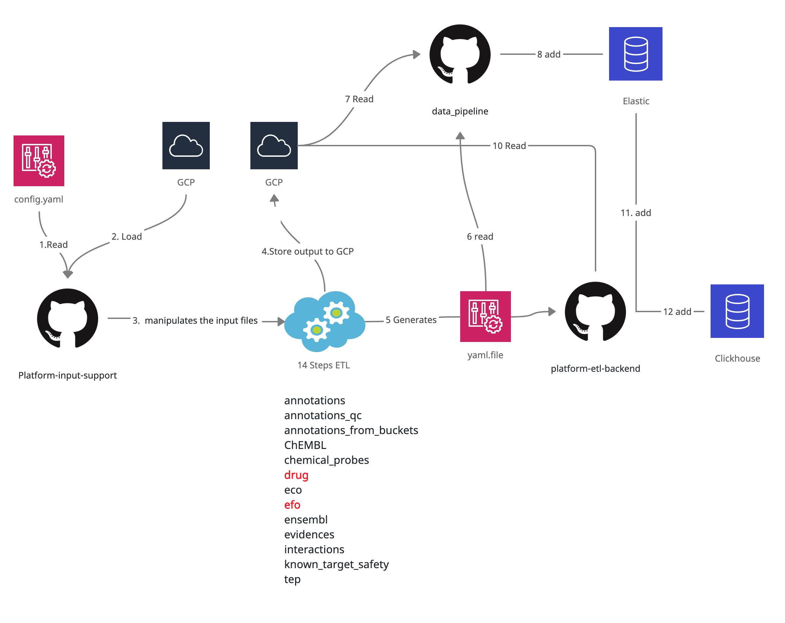

# ETL

## Repos

[**platform-input-support**](https://github.com/opentargets/platform-input-support) ****- scripts that process and prepare data for our ETL pipelines 

[**platform-etl-backend**](https://github.com/opentargets/platform-etl-backend) ****- ETL pipelines to generate associations, evidence, and entity indices 

\*\*\*\*[**platform-etl-openfda-faers** ](https://github.com/opentargets/platform-etl-openfda-faers) ****- ETL pipeline to process OpenFDA adverse events data 

[**json\_schema**](https://github.com/opentargets/json_schema) - evidence object schema used by ETL pipelines for evidence and association scoring

\*\*\*\*[**data\_pipeline**](https://github.com/opentargets/data_pipeline)  ****to process different data files that provide evidence for the target-disease associations in the Open Targets Platform. ****

\*\*\*\*

## ETL Workflow



Config.file : [https://github.com/opentargets/platform-input-support/blob/master/config.yaml](https://github.com/opentargets/platform-input-support/blob/master/config.yaml)

Yaml.file : [https://storage.googleapis.com/open-targets-data-releases/21.02/templates/template.mrtarget.data.21.02.yml](https://storage.googleapis.com/open-targets-data-releases/21.02/templates/template.mrtarget.data.21.02.yml) 

## Platform-input-support:

[**platform-input-support**](https://github.com/opentargets/platform-input-support) ****- scripts that process and prepare data for our ETL pipelines 

Collect data from various sources, put them into GCP.   

List of available steps:

* annotations
* annotations\_qc
* annotations\_from\_buckets
* ChEMBL
* chemical\_probes
* drug
* eco
* efo
* ensembl
* evidences
* interactions
* known\_target\_safety
* tep

Each step is an individual way to collect data. 

The input data is a config file, which contains the data source:   
[https://github.com/opentargets/platform-input-support/blob/master/config.yaml](https://github.com/opentargets/platform-input-support/blob/master/config.yaml) 

The output data are stored in three folders:

[http://ftp.ebi.ac.uk/pub/databases/opentargets/platform/21.02/input/annotation-files/](http://ftp.ebi.ac.uk/pub/databases/opentargets/platform/21.02/input/annotation-files/)

[http://ftp.ebi.ac.uk/pub/databases/opentargets/platform/21.02/input/evidence-files/](http://ftp.ebi.ac.uk/pub/databases/opentargets/platform/21.02/input/evidence-files/)

[http://ftp.ebi.ac.uk/pub/databases/opentargets/platform/21.02/input/evidence-files-subsets/](http://ftp.ebi.ac.uk/pub/databases/opentargets/platform/21.02/input/evidence-files-subsets/)

The  mrtage yam file contains all the locations of collected data, is part of the output 

[https://storage.googleapis.com/open-targets-data-releases/21.02/templates/template.mrtarget.data.21.02.yml](https://storage.googleapis.com/open-targets-data-releases/21.02/templates/template.mrtarget.data.21.02.yml)  


\*\*\*\*\*\*\*\*\*Note

this is only part of the data, the data from FAERS  treat separately. 


### \*\*\*\*


### EFO step \(disease\)

The EFO step is used to gather the raw data for the [platform ETL](https://github.com/opentargets/platform-etl-backend).

The scope of EFO is to support the annotation, analysis and visualization of data handled by the core ontology for Open Targets.

This step downloads and manipulates the input files and it generates the following output:

* ontology-efo-v3.xx.yy.jsonl : list of EFO terms
* ontology-mondo.jsonl : list of MONDO terms
* ontology-hpo.jsonl : list of HPO terms
* hpo-phenotypes-_yyyy-mm-dd_.jsonl : mapping between CrossReference databaseId

### Drug step

The Drug step is used to gather the raw data for the [platform ETL](https://github.com/opentargets/platform-etl-backend).

ChEMBL have made an Elasticsearch instance available for querying. To keep data volumes and running times down specify the index and fields which are required in the config file.

ChEMBL's ES instance is only available from within the EMBL-EBI VPN. If you need to run this step it is necessary that you use a machine that is connected to the VPN network.


## Data pipeline

[**data\_pipeline**](https://github.com/opentargets/data_pipeline)  ****to process different data files that provide evidence for the target-disease associations in the Open Targets Platform. ****




#### Overview

The pipeline can be broken down in a number of steps, each of which can be run as a separate command. Each command typically reads data from one or more sources \(such as a URL or local file, or Elasticsearch\) and writes into one or more Elasticsearch indexes.

**--rea Reactome**

Downloads and processes information into a local index for performance.

**--hpa Expression**

Downloads and processes information into a local index for performance.

**--gen Target**

Downloads and processes information from various sources. Is built around a "plugin" structure. Constructs an Elasticsarch index containg most of the information about each Target within the platform. It requires `--rea` reactome step. Note: HGNC,Ensembl,Uniprot plugins should always be first, as they initialize the gene list used in other plugins. Note: Chembl is required by the `--sea` step below.

**--efo Disease**

Downloads and processes the Experimental Factor Ontology, as well as Human Phenotype Ontology and other sources. Constructs an Elasticsarch index containg the information about each Disease within the platform.

**--eco Evidence Code**

Downloads and processes the Evidence Code Ontology and Sequence Ontology.

**--val Validation**

Read in evidence strings \(either from filesystem or URLs\) and validate. The validation includes syntatic JSON schema validation, as well as ensuring that the disease and target are appropriate. This step will also make some corrections to evidence, where appropriate. For example,replacing Uniprot protein identifiers with Ensembl gene identifiers. It requires `--gen` target, `--efo` disease, and `--eco` evidence code steps. It is expecting JSON matching schema [1.6.0](https://raw.githubusercontent.com/opentargets/json_schema/1.6.0/opentargets.json).

**--as Associations**

This step reads the valide evidence strings and calculates the appropriate assocations as well as calculated their scores. It requires `--val` validation, and `--hpa` expression steps.

**--sea Search**

This step will create the index `${DATA_RELEASE_VERSION}_search-data` which is used for the search function in the platform. It requires `--as` associations step.

**--ddr Relationships**

This step will compute the target-to-target and disease-to-disease relationships. It requires `--as` associations step.  


Inputs:



Command line template: https://github.com/opentargets/data\_pipeline/blob/master/mrtarget.ops.yml

ES: https://github.com/opentargets/data\_pipeline/blob/master/mrtarget.es.yml

### **--rea Reactome** 

**part of annotations data**

ReactomeProcess\(args.elasticseach\_nodes, es\_config.rea.name, es\_config.rea.mapping, es\_config.rea.setting, data\_config.reactome\_pathway\_data, data\_config.reactome\_pathway\_relation, args.rea\_workers\_writer, args.rea\_queue\_write\)

process\_all\(\)

-&gt; Reactome.py 

1. Generate a direct graph

Node from : reactome-pathway-data: [https://storage.googleapis.com/open-targets-data-releases/21.02/input/annotation-files/ReactomePathways-2021-02-09.txt](https://storage.googleapis.com/open-targets-data-releases/21.02/input/annotation-files/ReactomePathways-2021-02-09.txt)   
Edge from: reactome-pathway-relation: [https://storage.googleapis.com/open-targets-data-releases/21.02/input/annotation-files/ReactomePathwaysRelation-2021-02-09.txt](https://storage.googleapis.com/open-targets-data-releases/21.02/input/annotation-files/ReactomePathwaysRelation-2021-02-09.txt)

Node:{ id, name, species }

Edge:{id, child\_id}

2.  Save Graph to elastic search   
mapping: rea\_mappings.json

setting: rea\_settings.json 

docs = generate\_documents\(self.g\)

actions = elasticsearch\_actions\(docs, self.es\_index\)

set of dicts :dict\(id=node, label=node\_data\['name'\], path=paths, children=children, parents=parents, is\_root=node == 'root', ancestors=list\(ancestors\) \)


### **--hpa Expression**

\*\*\*\*

HPAProcess\(args.elasticseach\_nodes, es\_config.hpa.name, es\_config.hpa.mapping, es\_config.hpa.setting, data\_config.tissue\_translation\_map, data\_config.tissue\_curation\_map, data\_config.hpa\_normal\_tissue, data\_config.hpa\_rna\_level, data\_config.hpa\_rna\_value, data\_config.hpa\_rna\_zscore, args.hpa\_workers\_writer, args.hpa\_queue\_write\)

**inputs:**

args.elasticseach\_nodes,   
 es\_config.  
 hpa.name,   
 es\_config.hpa.mapping,   
 es\_config.hpa.setting,   
 data\_config.tissue\_translation\_map: none  
 data\_config.tissue\_curation\_map: none  
 hpa-normal-tissue: [https://storage.googleapis.com/open-targets-data-releases/21.02/input/annotation-files/normal\_tissue-2021-02-09.tsv](https://storage.googleapis.com/open-targets-data-releases/21.02/input/annotation-files/normal_tissue-2021-02-09.tsv)  
 hpa-rna-level: [https://storage.googleapis.com/open-targets-data-releases/21.02/input/annotation-files/baseline\_expression\_binned-2020-05-07.tsv](https://storage.googleapis.com/open-targets-data-releases/21.02/input/annotation-files/baseline_expression_binned-2020-05-07.tsv)  
 hpa-rna-value: [https://storage.googleapis.com/open-targets-data-releases/21.02/input/annotation-files/baseline\_expression\_counts-2020-05-07.tsv](https://storage.googleapis.com/open-targets-data-releases/21.02/input/annotation-files/baseline_expression_counts-2020-05-07.tsv)  
 hpa-rna-zscore: [https://storage.googleapis.com/open-targets-data-releases/21.02/input/annotation-files/baseline\_expression\_zscore\_binned-2020-05-07.tsv](https://storage.googleapis.com/open-targets-data-releases/21.02/input/annotation-files/baseline_expression_zscore_binned-2020-05-07.tsv)  
 args.hpa\_workers\_writer,   
 args.hpa\_queue\_write  


process\_all

```text
 self.hpa_normal_table = self.downloader.retrieve_normal_tissue_data()
        self.hpa_rna_table = self.downloader.retrieve_rna_data()
        self.hpa_merged_table = self.process_join()
        self.store_data(dry_run)
```

  
retrieve\_normal\_tissue\_data-&gt; download data from hpa-normal-tissue as CSV file, use it as a dictionary object.

retrieve\_rna\_data:  read data from hpa-rna-level and hpa-rna-zscore, then  melting rna level table into geneid tissue level.

process\_join\(\)-&gt;  melting retrieve\_normal\_tissue\_data and retrieve\_rna\_data, plus new format of expression \(dictionary\)

store\_data-&gt; save hpa\_merged\_table to elasticsearch

### **--gen Target**

```text
 process = GeneManager(args.elasticseach_nodes, es_config.gen.name, 
            es_config.gen.mapping, es_config.gen.setting, 
            args.gen_plugin_places, data_config.gene_data_plugin_names,
            data_config, es_config,
            args.gen_workers_writer, args.gen_queue_write )
        if not args.qc_only:
            process.merge_all(args.dry_run)
        if not args.skip_qc:
            qc_metrics.update(process.qc(es, es_config.gen.name))  
```

**inputs:**

args.elasticseach\_nodes  
 es\_config.gen.name  
 es\_config.gen.mapping  
 es\_config.gen.setting  
 args.gen\_plugin\_places  
 data\_config.gene\_data\_plugin\_names**:  null???**  
 data\_config  
 es\_config  
 args.gen\_workers\_writer  
 args.gen\_queue\_write


plugin system : [http://yapsy.sourceforge.net/\#](http://yapsy.sourceforge.net/#)

```text
plugin.plugin_object.merge_data(self.genes, 
                es, None, 
                self.data_config, self.es_config)
```

the plugin is read from somewhere unknown. 

It seems like the genes obj is modified within plugin.

```text
 gene._create_suggestions()
```

reorder gene's field, add suggestion filed, code below shows the content of suggestions. 

```text
    field_order = [self.approved_symbol,
                       self.approved_name,
                       self.symbol_synonyms,
                       self.name_synonyms,
                       self.previous_symbols,
                       self.previous_names,
                       self.uniprot_id,
                       self.uniprot_accessions,
                       self.ensembl_gene_id,
                       self.entrez_gene_id,
                       self.refseq_ids
                       ]
   self._private['suggestions'] = dict(input = [],
                                              output = self.approved_symbol,
                                              payload = dict(gene_id = self.id,
                                                             gene_symbol = self.approved_symbol,
                                                             gene_name = self.approved_name),
                                              )


        for field in field_order:
            if isinstance(field, list):
                self._private['suggestions']['input'].extend(field)
            else:
                self._private['suggestions']['input'].append(field)
        try:
            self._private['suggestions']['input'] = [x.lower() for x in self._private['suggestions']['input']]
        except:
            print("error", repr(self._private['suggestions']['input']))
```

```text
gene._create_facets()
```

add pathway info in gene.\_create\_facets\(\) step.  code below shows how it does. 

```text
 self._private['facets']['reactome']=dict(pathway_code = pathways,
              # pathway_name=pathways,
               pathway_type_code=pathway_types,
              # pathway_type_name=pathway_types,
  )
```

  
Then gene is stored in elastic search. 

### **--efo Disease**

```text
  process = EfoProcess(args.elasticseach_nodes, es_config.efo.name, 
            es_config.efo.mapping, es_config.efo.setting, 
            data_config.ontology_efo, data_config.ontology_hpo, 
            data_config.ontology_mp, data_config.disease_phenotype,
            args.efo_workers_writer, args.efo_queue_write)
        if not args.qc_only:
            process.process_all(args.dry_run)
```

inputs:

args.elasticseach\_nodes  
 es\_config.efo.name  
 es\_config.efo.mapping  
 es\_config.efo.setting  
 data\_config.ontology\_efo  
 data\_config.ontology\_hpo  
 data\_config.ontology\_mp  
 data\_config.disease\_phenotype  
 args.efo\_workers\_writer  
 args.efo\_queue\_write  


