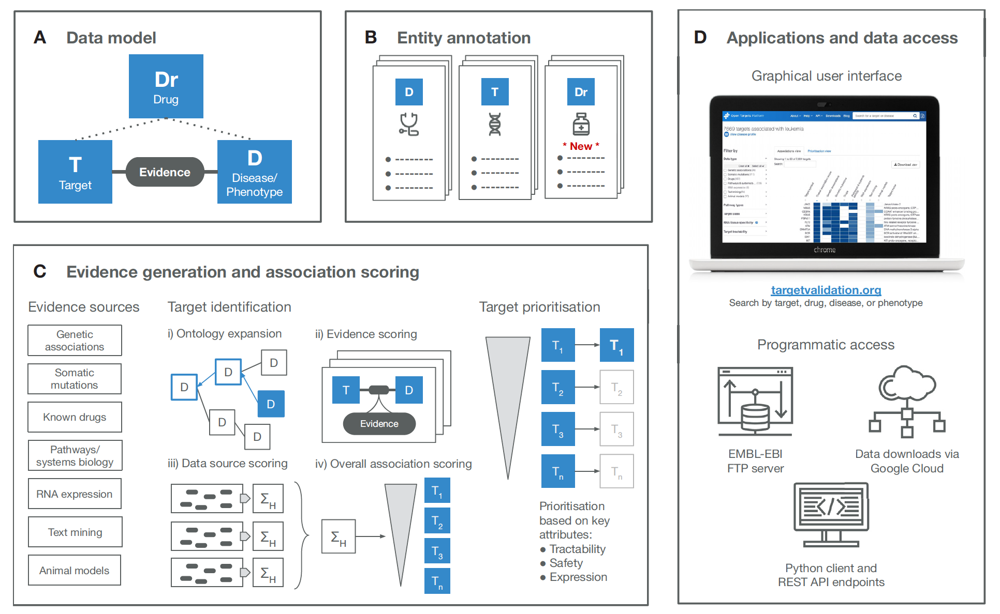
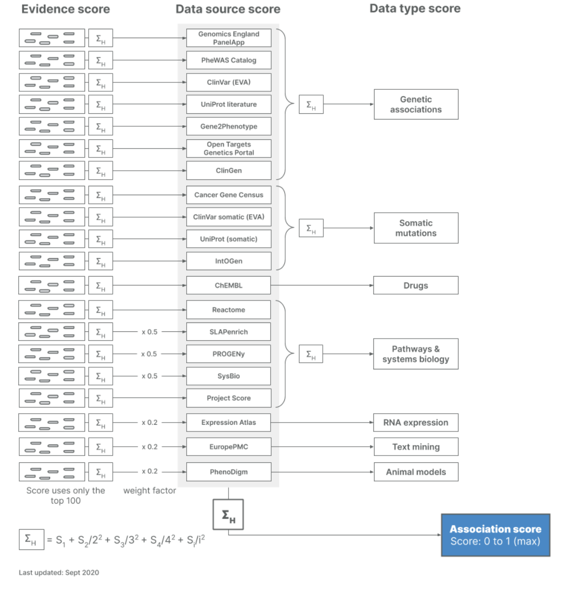

# Untitled

Questions:

1. Targets, disease and drugs 

drug annotation with a statistical analysis on post-marketing significant adverse drug reactions \(ADRs\) from FDA Adverse Event Reporting System \(FAERS\) The significant drug- ADR pairs were then evaluated using a Likelihood Ratio Test \(LRT\) and critical values inferred using a Montecarlo simulation

  

Annotation sparsity

  
Target–disease evidence scoring

  

Consolidating evidence into target–disease associations at data source or data type level.  

Estimating an overall association score.

Scoring function: [https://docs.targetvalidation.org/getting-started/scoring](https://docs.targetvalidation.org/getting-started/scoring)

Our scoring framework is a **four-tier process**: 

1. we first score the individual evidence, 
2.  we aggregate the evidence scores into data sources scores, 
3.  aggregation of data source scores to give rise to the data types scores.
4.  Our overall association score is the result of the aggregation of all data source scores together.

At each aggregation step, denoted by the `sum` symbol above, we apply the [harmonic progression](https://en.wikipedia.org/wiki/Harmonic_progression_%28mathematics%29) using the following formula as follows:

