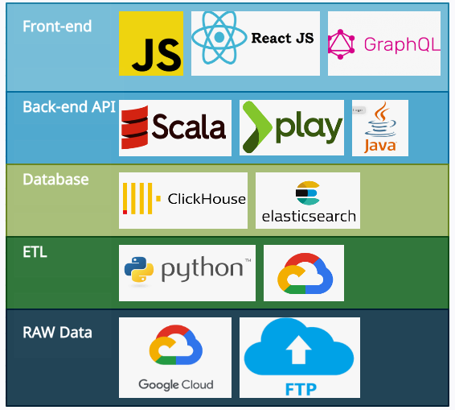

# OpenTargets Overview

## **Introduction**

The new version of open target:  [https://beta.targetvalidation.org/](https://beta.targetvalidation.org/)

The new version is expected to be released in Q1 2021.   
  
****

## **Github Repositories**

 [platform-app](https://github.com/opentargets/platform-app) - React UI

[platform-api-beta](https://github.com/opentargets/platform-api-beta) - GraphQL API

[platform-input-support](https://github.com/opentargets/platform-input-support) - scripts that process and prepare data for our ETL pipelines 

[platform-etl-backend](https://github.com/opentargets/platform-etl-backend) - ETL pipelines to generate associations, evidence, and entity indices 

[platform-etl-openfda-faers ](https://github.com/opentargets/platform-etl-openfda-faers) - ETL pipeline to process OpenFDA adverse events data

[json\_schema](https://github.com/opentargets/json_schema) - evidence object schema used by ETL pipelines for evidence and association scoring

[genetics-app ](https://github.com/opentargets/genetics-app) ****-- frontend repo for genetics app

[OT evidence generators](https://github.com/opentargets/evidence_datasource_parsers) .-- OT evidence generators   
****

## Data

The database dump files are available via FTP from [http://ftp.ebi.ac.uk/pub/databases/opentargets/platform/21.02/output/ETL/](http://ftp.ebi.ac.uk/pub/databases/opentargets/platform/21.02/output/ETL/). 

Load the data, please use the following scripts: 

 ElasticSearch: [https://github.com/opentargets/platform-etl-backend/tree/21.02/elasticsearch](https://github.com/opentargets/platform-etl-backend/tree/21.02/elasticsearch) 

 ClickHouse: [https://github.com/opentargets/platform-etl-backend/tree/21.02/clickhouse](https://github.com/opentargets/platform-etl-backend/tree/21.02/clickhouse)

## **Documentation** 

**TBD**  

## **Support**

 ****General: contact@opentargets.org &lt;[contact@opentargets.org](mailto:contact@opentargets.org)&gt;

 Got response from Andrew Hercules &lt;[ahercules@ebi.ac.uk](mailto:ahercules@ebi.ac.uk)&gt;

## **Observations**

### **Front-end**

[**https://github.com/opentargets/platform-app**](https://github.com/opentargets/platform-app) ****

It is a react application.  Using GraphQL and REST API to get data. 

D3.js is widely used to support data visualization.  
****

### **Back-end** 

\*\*\*\*[**https://github.com/opentargets/platform-api-beta**](https://github.com/opentargets/platform-api-beta)  ****

Program:

* Scala and Play framework.  
* GraphQL:  They construct the GraphQL from scratch, we need to understand the concept of GraphQL. 

Database:  Clickhouse and Elasticsearch 7.2.   
****

Tech Stack

* Scala   https://www.scala-lang.org/
* PlayFramework : https://www.playframework.com/ 
* Clickhouse  https://clickhouse.tech/
* Elasticsearch https://www.elastic.co/
* GraphQL [https://graphql.org/](https://graphql.org/) [https://www.howtographql.com/graphql-scala/0-introduction/](https://www.howtographql.com/graphql-scala/0-introduction/) https://graphql.org/community/ 
* AKKA HTTP Server https://akka.io/

### **Others**

Old Frontend: [https://github.com/opentargets/webapp](https://github.com/opentargets/webapp)

Old Backend: [https://github.com/opentargets/rest\_api](https://github.com/opentargets/rest_api)

Old Documentation: [https://docs.targetvalidation.org/faq/spin-your-own-instance](https://docs.targetvalidation.org/faq/spin-your-own-instance)

Old Version: [https://www.targetvalidation.org/](https://www.targetvalidation.org/)

###  **Tech Stack**

